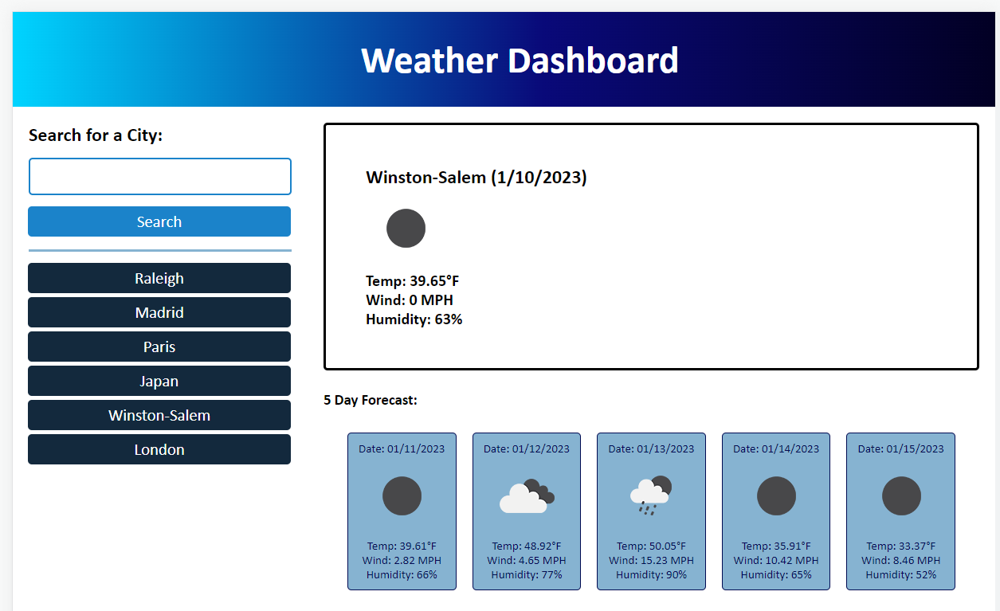

# blue-weather-dashboard

## About

This challenge was to work with serverside APIs, specifically openweathermap.org's.  It was a big task since all the HTML, CSS, JavaScript had to be done by scratch.  

I first broke it down into doing the items I knew how to do, such as setting up the skeleton of the HTML, adding classes/ids for different divs, and creating variables in JavaScript that I knew I would be using and manipulating.  From there, I started a TODO list in the JavaScript of different goals, functions, ect that I would need to write, and marked them off as they were completed. 

It was a challenge, but a fun challenge, to console.log the different variables and functions that I used to see the data that I wanted to capture and figure out how to grab that data to be able to use it in my code and website.  

Although minor in comparison, I think my biggest accomplishment that I am most proud of, is getting the date back from the getForecast function and splitting it in a way so I could display the date in a MM/DD/YYYY format.  

Or maybe that was just one of the last things I did so it sticks out in my memory! 😊

## Links
github Repository: https://github.com/erinsawyer504/blue-weather-dashboard

Deployed Website: 


## Your Task

Third-party APIs allow developers to access their data and functionality by making requests with specific parameters to a URL. Developers are often tasked with retrieving data from another application's API and using it in the context of their own. Your challenge is to build a weather dashboard that will run in the browser and feature dynamically updated HTML and CSS.

Use the [5 Day Weather Forecast](https://openweathermap.org/forecast5) to retrieve weather data for cities. The base URL should look like the following: `https://api.openweathermap.org/data/2.5/forecast?lat={lat}&lon={lon}&appid={API key}`. After registering for a new API key, you may need to wait up to 2 hours for that API key to activate.

**Hint**: Using the 5 Day Weather Forecast API, you'll notice that you will need to pass in coordinates instead of just a city name. Using the OpenWeatherMap APIs, how could we retrieve geographical coordinates given a city name?

You will use `localStorage` to store any persistent data. For more information on how to work with the OpenWeather API, refer to the [Full-Stack Blog on how to use API keys](https://coding-boot-camp.github.io/full-stack/apis/how-to-use-api-keys).

## User Story

```
AS A traveler
I WANT to see the weather outlook for multiple cities
SO THAT I can plan a trip accordingly
```

## Acceptance Criteria

```
GIVEN a weather dashboard with form inputs
WHEN I search for a city
THEN I am presented with current and future conditions for that city and that city is added to the search history
WHEN I view current weather conditions for that city
THEN I am presented with the city name, the date, an icon representation of weather conditions, the temperature, the humidity, and the wind speed
WHEN I view future weather conditions for that city
THEN I am presented with a 5-day forecast that displays the date, an icon representation of weather conditions, the temperature, the wind speed, and the humidity
WHEN I click on a city in the search history
THEN I am again presented with current and future conditions for that city
```

## Mock-Up

The following image shows the web application's appearance and functionality:




- - -
© 2022 edX Boot Camps LLC. Confidential and Proprietary. All Rights Reserved.
